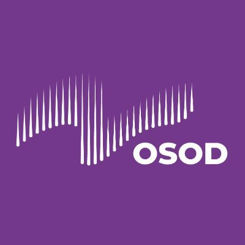
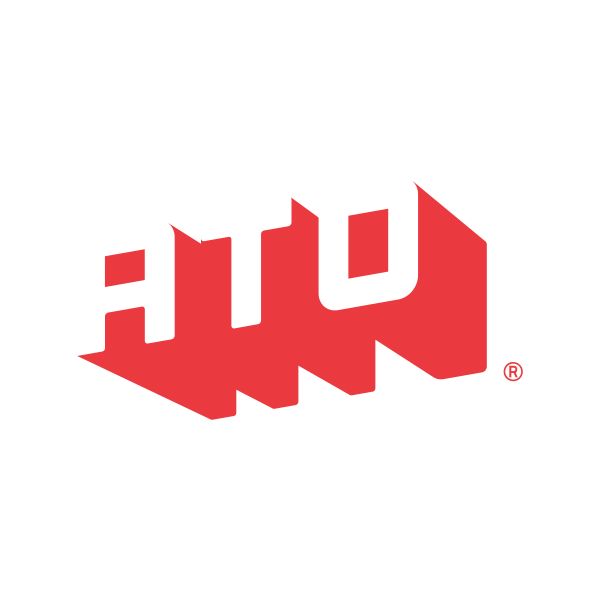

Four months after launch, the OurSQL Foundation has run its first booth, opened its map of the MySQL ecosystem, and scheduled its first webinars. Here's what happened, and three easy ways to be part of what comes next.

**New here?** Start with why we exist. Vadim Tkachenko explains why MySQL needs a vendor-neutral home, and why we see MySQL the way the world sees Linux — [read the announcement (3 min) →](/blog/introducing-oursql-foundation/)

In this issue:

- What we learned by giving our first booth away
- The OurSQL Universe: add what's missing
- Coming up: Oct 15 webinar · Oct 15–16 OSOD · Oct 19–20 All Things Open · Nov 3 webinar

## What we learned in Amsterdam

For our first conference booth, at Percona Live Amsterdam (September 9–11), we did something unusual: we gave the booth away.

The MySQL Ecosystem Spotlight split our table into time slots for five smaller projects: dbtrail, MyVector, AliSQL, MySQL Advisor, and HammerDB. Each one got to demo its work to people who might never have found it otherwise.

One moment stayed with us. Someone walked up to HammerDB's Steve Shaw and told him:

> "You don't realize how many people's lives you have changed."

One question kept coming back, again and again: **"How can I get involved?"**

[Read the full recap →](/blog/mysql-ecosystem-spotlight-recap/)

## How to get involved: the OurSQL Universe

Here's our answer to that question: help make the ecosystem visible.

The OurSQL Universe is our growing map of everything around MySQL, including software, services, people, events, books, and blogs. It will only be as complete as the community makes it.

Built a tool? Run a meetup? Wrote the blog post your whole team has bookmarked? Know a project that deserves more users? [Add it →](/resources/contribute/)

Want to contribute more than a listing? [Join us on Slack](https://join.slack.com/t/oursqlfoundation/shared_invite/zt-480k6h62a-t0HalCPwvXUC_lpd4aNylA), and we'll help you find where you fit.

## Coming up

Missed Amsterdam? Two of its sessions are coming online.

### Webinars

**[MySQL Time Travel: Practical Row-Level Recovery With Open Source Tools](/community/webinars/mysql-time-travel-row-level-recovery/)** — Oct 15 · Daniel Guzmán Burgos, creator of dbtrail

A bad `UPDATE` hit a handful of rows. Do you really need to restore a full backup and replay binlogs? In a mostly live demo, Daniel shows how to see exactly which rows changed, query any table as it looked at a past moment, and generate the exact statements to undo the damage. [Save your seat →](/community/webinars/mysql-time-travel-row-level-recovery/)

**[Beyond the Proxy: The Expanding ProxySQL Ecosystem](/community/webinars/beyond-the-proxy-proxysql-ecosystem/)** — Nov 3 · René Cannaò (CEO) & Alkin Tezuysal (Chief Strategy Officer), ProxySQL

ProxySQL has grown well beyond a proxy. René and Alkin cover MySQL and PostgreSQL support, the expansion toward DuckDB, deeper cloud integration, and where Orchestrator and dbdeployer fit in — tied together through real operational problems instead of a feature list. [Save your seat →](/community/webinars/beyond-the-proxy-proxysql-ecosystem/)

### Conferences

<figure class="figure--logo">
  
</figure>

**Open Source Observability Day 2026** — Oct 15–16 · Online · Free

We're a community partner at OSOD, a free two-day online conference on open source observability. There are strong database sessions this year, and Peter Zaitsev from our founding board opens Day 1. [Register free →](https://osoday.com/register)

<figure class="figure--logo">
  
</figure>

**All Things Open 2026** — Oct 19–20 · Raleigh, NC

We're a nonprofit partner at ATO, the largest open source conference on the US East Coast. It takes place in Raleigh, the same city where the Foundation launched. The co-located events on Monday are free. Going? [Let us know on Slack](https://join.slack.com/t/oursqlfoundation/shared_invite/zt-480k6h62a-t0HalCPwvXUC_lpd4aNylA) — we'd love to meet in person. [See the program →](https://2026.allthingsopen.org/)

---

That's issue #1. We're building this Foundation in the open, so tell us what you'd like to see in the next one — [reach out](/about/contact-us/) or find us on [Slack](https://join.slack.com/t/oursqlfoundation/shared_invite/zt-480k6h62a-t0HalCPwvXUC_lpd4aNylA).

Maria Nesterova
Managing Director, OurSQL Foundation

**P.S.** Between newsletters, the fastest way to reach us and the community is Slack. [Join the conversation →](https://join.slack.com/t/oursqlfoundation/shared_invite/zt-480k6h62a-t0HalCPwvXUC_lpd4aNylA)

*Know someone building around MySQL? Share this post — they can subscribe to future issues at the bottom of any page on [oursqlfoundation.org](https://oursqlfoundation.org).*
